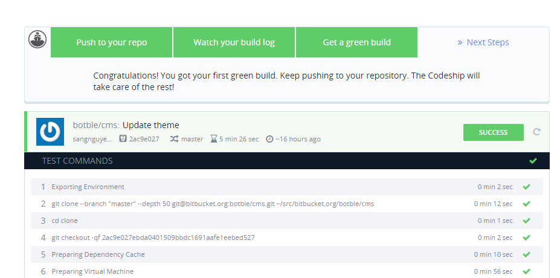
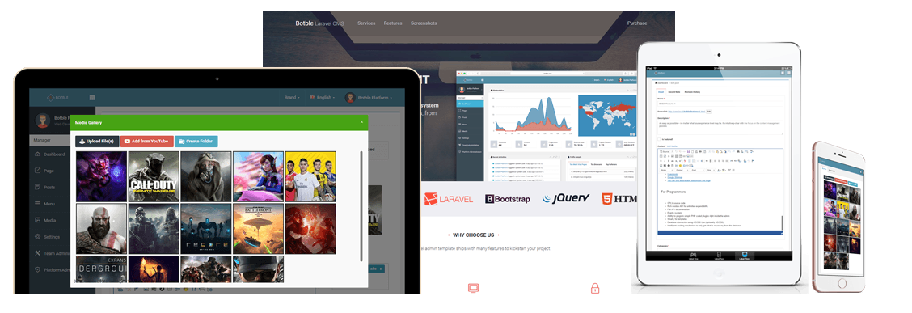

# Creative - Multipurpose Laravel Blog

## Introduction

Creat is a multipurpose shop script using Laravel 7.x. It's a product built on Botble CMS.

Created: `10 Jan 2021`

By: [ProUp Team](https://proup.dev)

Email: [myproup.dev@gmail.com](mailto:myproup.dev@gmail.com)

Thank you for purchasing this product. If you have any questions that are beyond the scope of this help file, please
feel free to email via my user page contact form [here](https://codecanyon.net/user/proupdev) for quickly support.
Thank you so much!

## Demo

Homepage: [https://creative.proup.dev](https://creative.proup.dev)

Admin Area: [https://creative.proup.dev/admin](https://creative.proup.dev/admin)

Username: `botble`

Password: `159357`

## Why choose us

Coding Standard: All code follow coding standards PSR-2 and best practices. Validated
by [Codeship](https://codeship.com)

Fully Responsive: Compatible with all screen resolutions

Powerful Permission System: Manage user, team, role by permissions. Easy to manage user by permissions.

Page, blog, menu, contact modules are provided with the use of components to avoid boilerplate code.

A vast number of jQuery components are provided, which helps you save time.

Admin template comes with color schemes to match your taste.

## ProUp Team

Visit us at [https://proup.dev](https://proup.dev)

## Botble Team

Visit us at [https://botble.com](https://botble.com)
